# DocMind AI - System Architecture

## 🏗️ High-Level Architecture

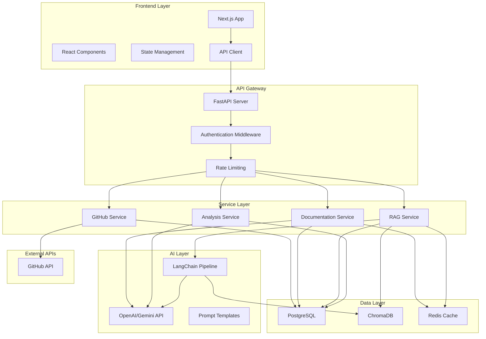

## 📦 Component Architecture

### Frontend Architecture

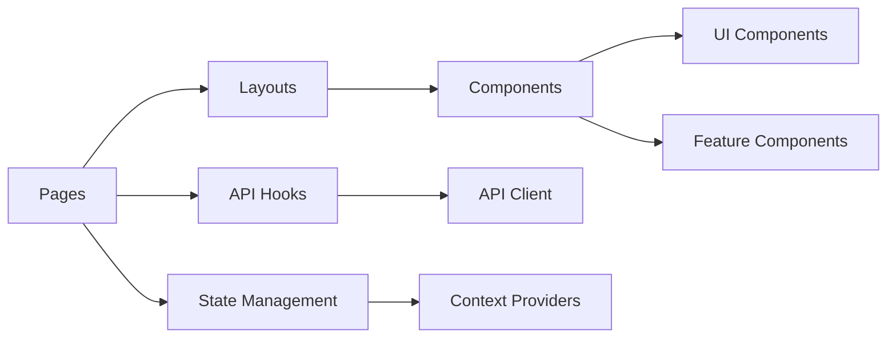

#### Key Components

1. **Dashboard Layout**
   - Left Sidebar: Repository tree, PR history
   - Center Panel: Documentation viewer
   - Right Sidebar: AI chat assistant
   - Top Bar: Repository input, actions

2. **Repository Explorer**
   - File tree visualization
   - File content viewer
   - Syntax highlighting

3. **Documentation Viewer**
   - Markdown renderer
   - Code block highlighting
   - Mermaid diagram support
   - Table of contents

4. **Chat Interface**
   - Message history
   - Streaming responses
   - Code snippet rendering
   - Context indicators

5. **PR Analyzer**
   - Diff viewer
   - Change summary
   - Documentation suggestions

### Backend Architecture

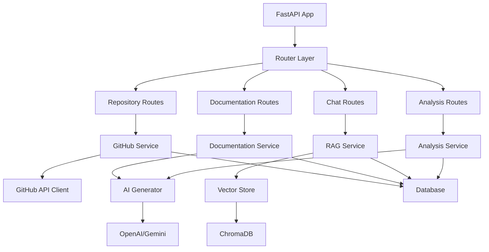

#### Service Layer

1. **GitHub Service**
   - Repository fetching
   - File content retrieval
   - PR analysis
   - Commit history

2. **Documentation Service**
   - Content generation
   - Template management
   - Version control
   - Export functionality

3. **RAG Service**
   - Document chunking
   - Embedding generation
   - Vector storage
   - Semantic search
   - Context retrieval

4. **Analysis Service**
   - Code parsing
   - Function detection
   - API endpoint extraction
   - Missing doc detection

## 🔄 Data Flow

### 1. Repository Analysis Flow

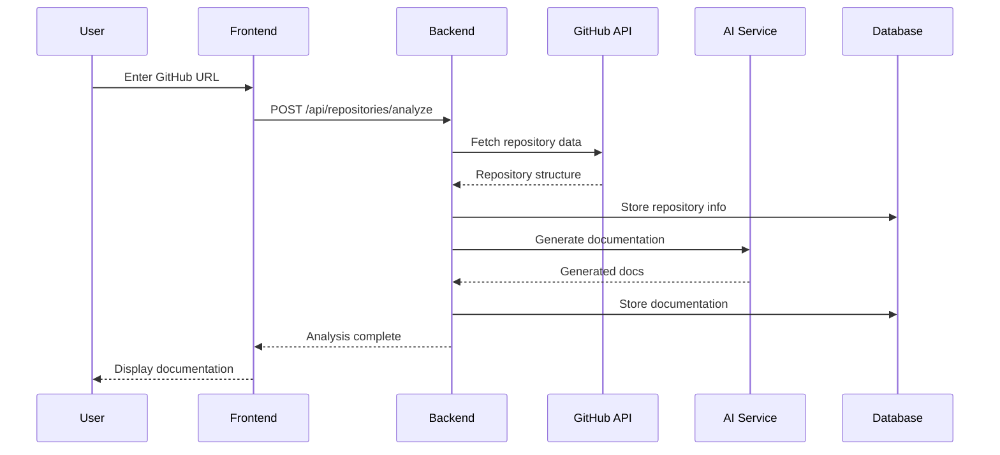

### 2. RAG Chat Flow

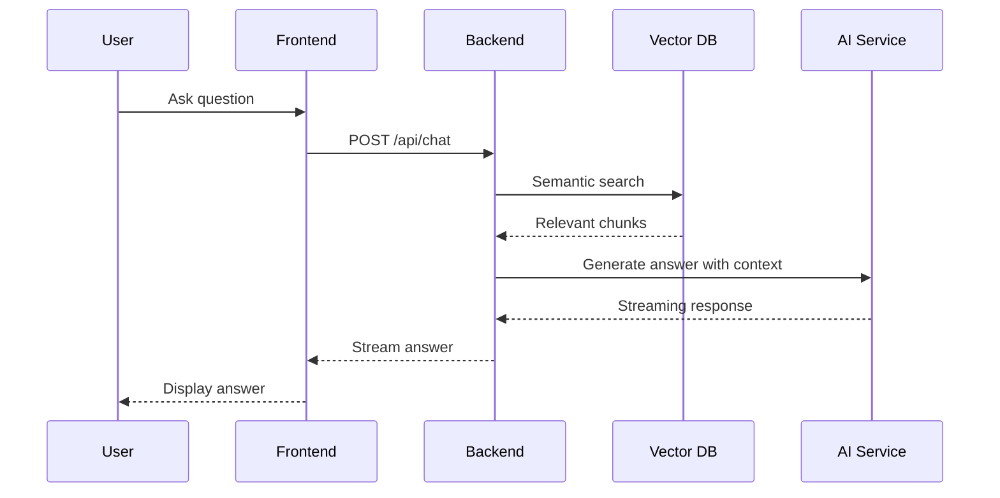

### 3. PR Analysis Flow

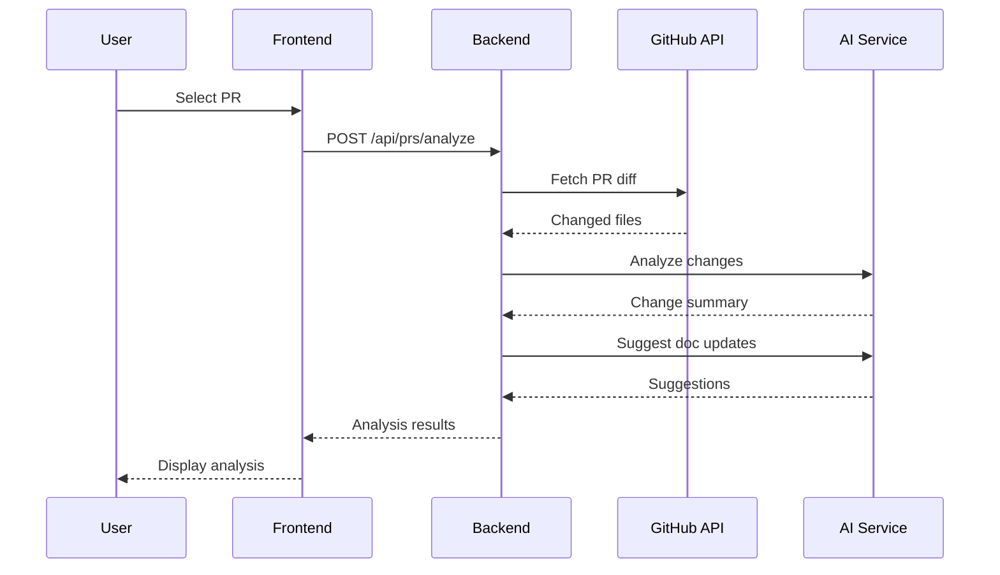

## 💾 Database Schema

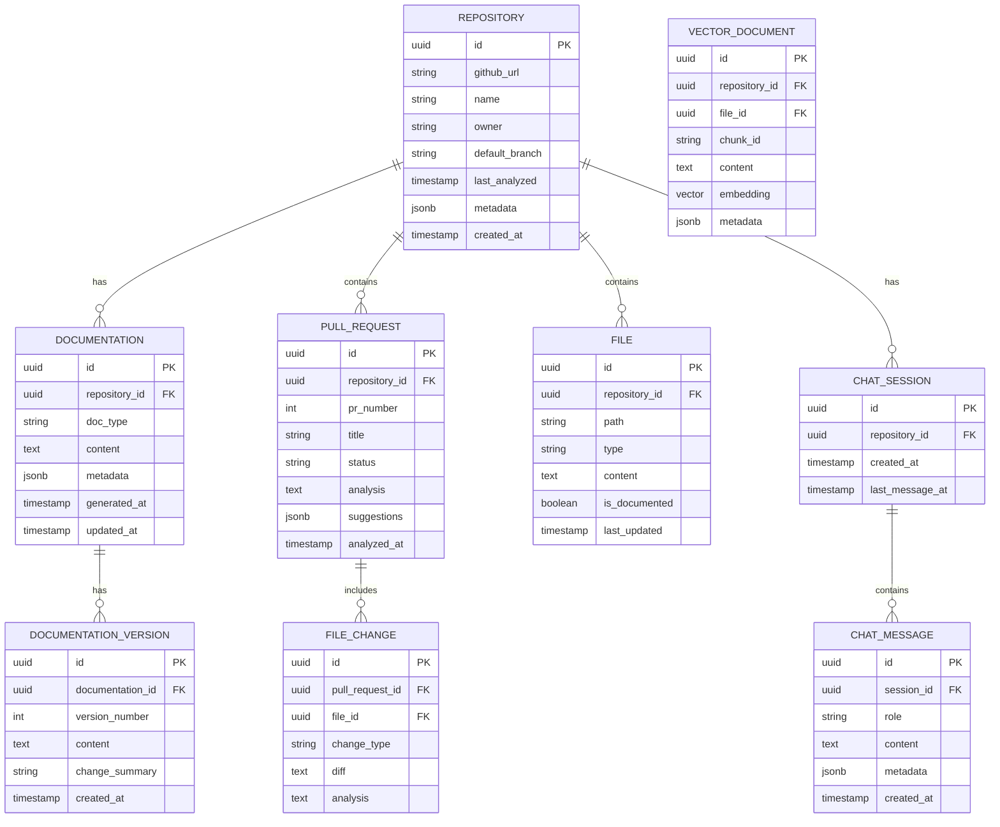

## 🤖 AI Pipeline Architecture

### Documentation Generation Pipeline

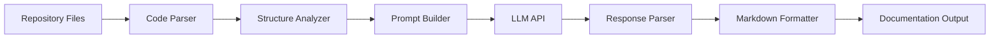

### RAG Pipeline

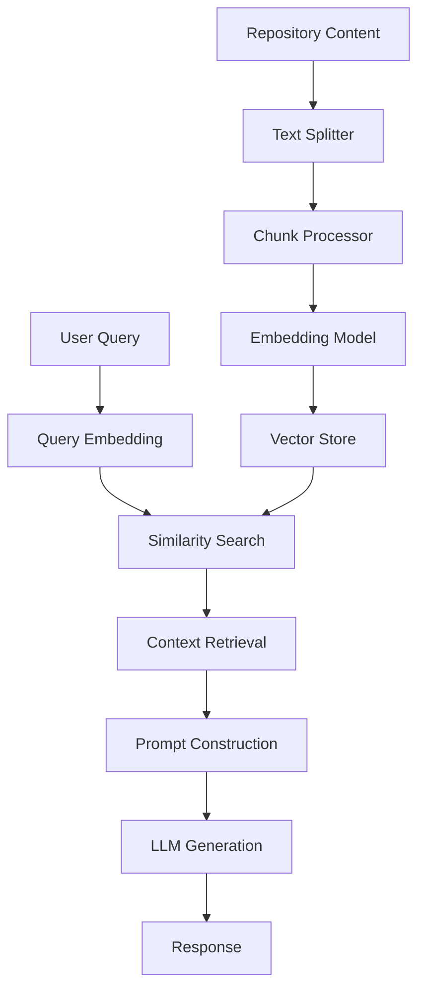

## 🔐 Security Architecture

### Authentication & Authorization

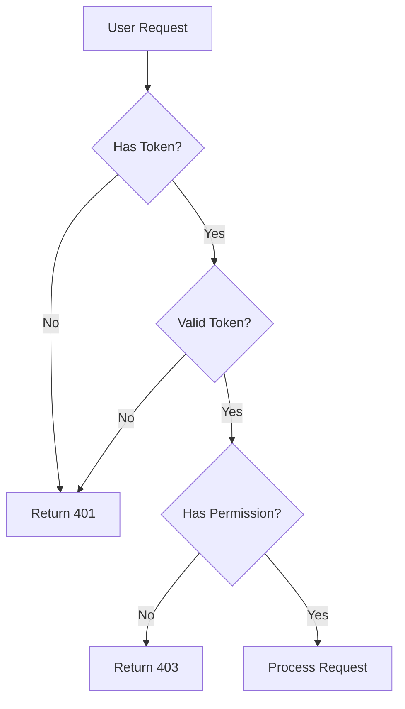

### API Security Layers

1. **Rate Limiting**
   - Per-IP limits
   - Per-user limits
   - Endpoint-specific limits

2. **Input Validation**
   - Pydantic schemas
   - URL validation
   - Content sanitization

3. **API Key Management**
   - Environment variables
   - Secret rotation
   - Encrypted storage

## 📊 Caching Strategy

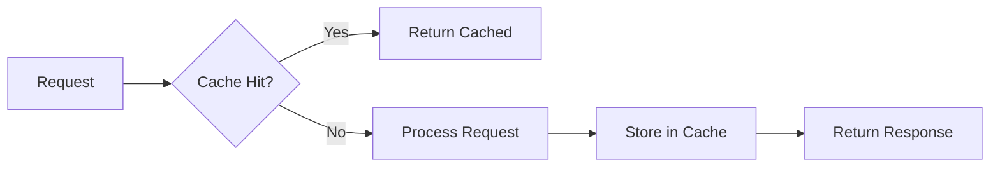

### Cache Layers

1. **Repository Metadata** - 1 hour TTL
2. **Generated Documentation** - 24 hours TTL
3. **File Contents** - 6 hours TTL
4. **Vector Embeddings** - Persistent
5. **API Responses** - 5 minutes TTL

## 🚀 Scalability Considerations

### Horizontal Scaling

- **Frontend**: Deploy multiple Next.js instances behind load balancer
- **Backend**: Multiple FastAPI workers with shared database
- **Vector DB**: ChromaDB cluster or migrate to Pinecone/Weaviate
- **Cache**: Redis cluster for distributed caching

### Performance Optimizations

1. **Lazy Loading**: Load repository files on-demand
2. **Streaming**: Stream AI responses for better UX
3. **Background Jobs**: Queue heavy processing tasks
4. **CDN**: Cache static assets and documentation
5. **Database Indexing**: Optimize query performance

## 🔄 Deployment Architecture

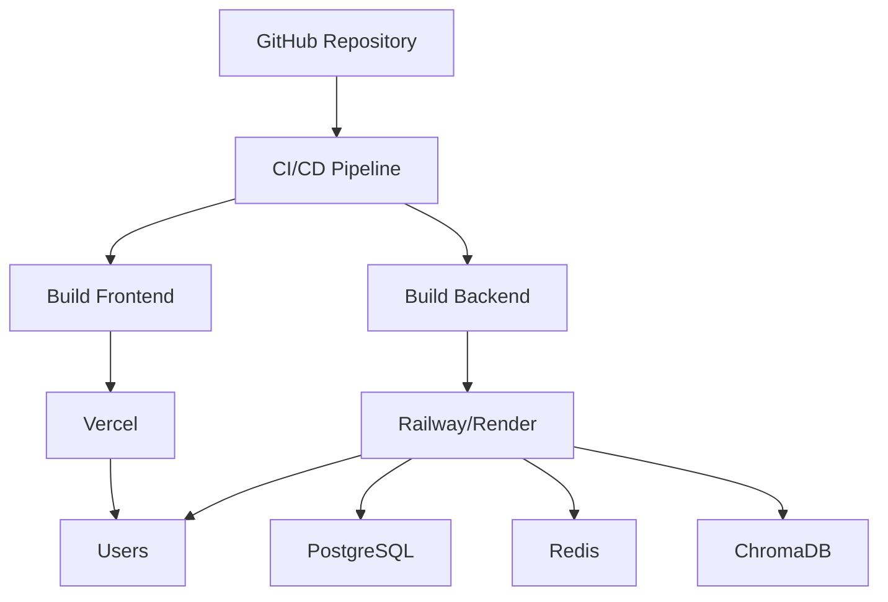

### Infrastructure Components

1. **Frontend Hosting**: Vercel (auto-scaling, edge network)
2. **Backend Hosting**: Railway/Render (containerized deployment)
3. **Database**: Supabase/Neon (managed PostgreSQL)
4. **Cache**: Upstash Redis (serverless Redis)
5. **Vector DB**: ChromaDB (self-hosted) or Pinecone (managed)
6. **Monitoring**: Sentry for error tracking
7. **Analytics**: PostHog for usage analytics

## 📈 Monitoring & Observability

### Key Metrics

1. **Application Metrics**
   - Request latency
   - Error rates
   - API usage
   - Cache hit rates

2. **AI Metrics**
   - Token usage
   - Generation time
   - Quality scores
   - Cost tracking

3. **Business Metrics**
   - Repositories analyzed
   - Documentation generated
   - Chat interactions
   - User engagement

### Logging Strategy

```python
# Structured logging with context
{
    "timestamp": "2024-01-15T10:30:00Z",
    "level": "INFO",
    "service": "documentation-service",
    "repository_id": "uuid",
    "action": "generate_documentation",
    "duration_ms": 1500,
    "tokens_used": 2500
}
```

## 🎯 Technology Decisions

### Why Next.js?
- Server-side rendering for better SEO
- API routes for BFF pattern
- Excellent developer experience
- Built-in optimization

### Why FastAPI?
- High performance (async support)
- Automatic API documentation
- Type safety with Pydantic
- Easy integration with Python AI libraries

### Why ChromaDB?
- Simple setup for MVP
- Built-in embedding support
- Good for hackathon speed
- Can migrate to Pinecone later

### Why PostgreSQL?
- Robust relational database
- JSON support for flexibility
- Vector extension available (pgvector)
- Wide hosting support

---

This architecture is designed for rapid development while maintaining scalability and maintainability for future growth.
